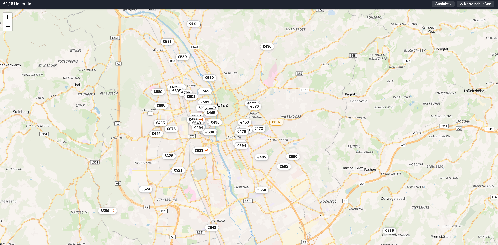
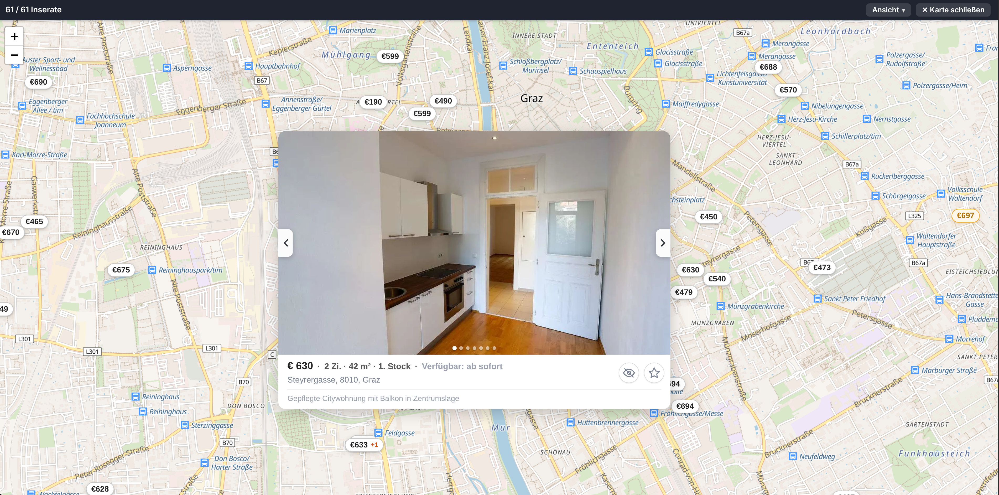

# willkarte 🗺️

Immobilien-Inserate von willhaben.at auf einer Karte.

Filter wie gewohnt auf willhaben setzen, dann auf **🗺 Karte** klicken — jede Wohnung
bzw. jedes Haus aus der Suche erscheint als Preis-Pin auf einer interaktiven Karte.

Beim Anklicken öffnet sich ein Vorschaufenster mit Fotos, Größe, Zimmern,
Adresse, Stockwerk und Verfügbarkeit; ein Klick ins Bild führt zum Inserat. Über den Stern lassen sich Inserate direkt von der Karte aus zur Merkliste hinzufügen oder entfernen (dafür muss man bei willhaben angemeldet sein).

Man kann außerdem Inserate, die man nicht mehr sehen will, ausblenden in dem man auf das Augenszmbol klickt. Unter Anzeige, in der oberen Leiste, lassen sich dann ein paar zusätzliche Einstellungen dazu treffen.

## Installation

### Chromium-based (Chrome, Edge, Brave...)

**`willkarte-chromium.zip`** aus den [**Releases**](../../releases/latest) herunterladen
und entpacken (oder das Repo clonen). Dann:

1. `chrome://extensions` öffnen
2. **Entwicklermodus** aktivieren (rechts oben)
3. Auf **Entpackte Erweiterung laden** klicken und den entpackten Ordner **`willkarte-chromium`** auswählen

### Firefox

**`willkarte-firefox.xpi`**-Datei aus den [**Releases**](../../releases/latest) herunterladen.

Am einfachsten die Datei dann direkt **in ein Firefox-Fenster ziehen** — Firefox fragt
sofort, ob das Add-on installiert werden soll.

Alternativ über das Menü:

1. `about:addons` öffnen
2. ⚙️ → **Add-on aus Datei installieren…**
3. die heruntergeladene **`willkarte-firefox.xpi`** auswählen

---

Danach eine beliebige Immobiliensuche auf willhaben öffnen und rechts unten auf
**🗺 Karte** klicken. Falls der Button fehlt, die Seite neu laden.

## Hinweis zur Genauigkeit der Positionen

Die Koordinaten stammen direkt von willhaben — willkarte zeichnet sie nur ein.
**Nicht jedes Inserat liegt exakt an der richtigen Stelle.** Vor allem dort, wo keine
genaue Adresse angegeben ist, sondern nur z. B. eine Postleitzahl oder ein Bezirk,
setzt willhaben die Koordinaten irgendwo in dieses Gebiet (oft in dessen Mitte).
Solche Inserate können also einige Straßenzüge danebenliegen — mehrere Inserate
landen dann auch gerne auf demselben Punkt. Die Karte ist damit gut für den
Überblick, aber die genaue Lage bitte immer im Inserat selbst prüfen.

## Attribution

Kartendaten © [OpenStreetMap](https://www.openstreetmap.org/copyright)-Mitwirkende,
Tiles von [OpenFreeMap](https://openfreemap.org). Gebaut mit
[Leaflet](https://leafletjs.com) und [MapLibre GL](https://maplibre.org).
Inseratsdaten von [willhaben.at](https://www.willhaben.at).
